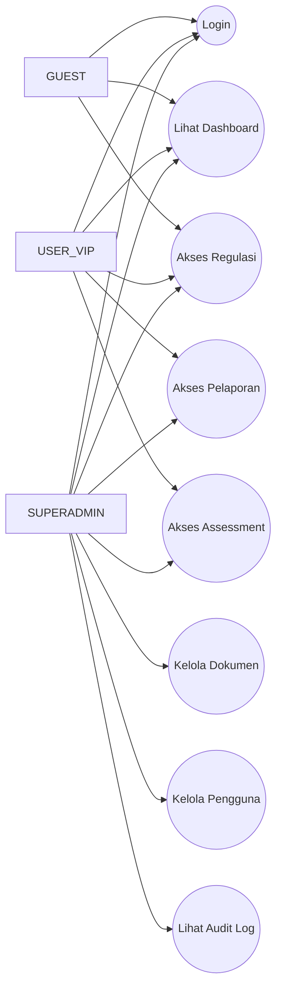
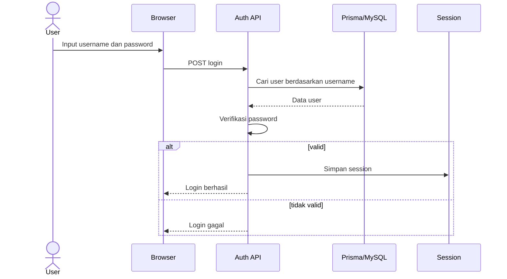
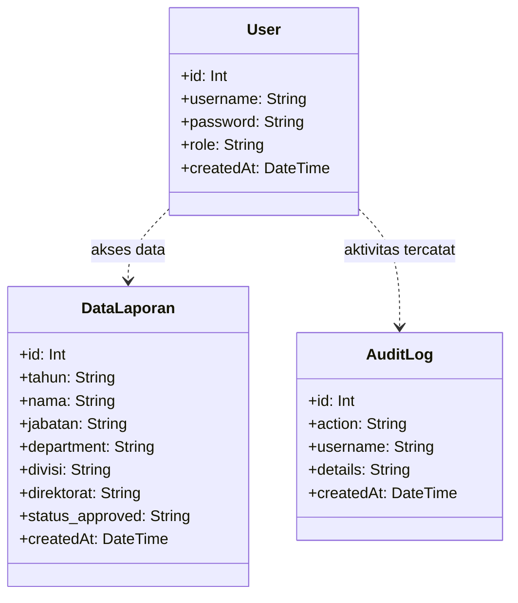
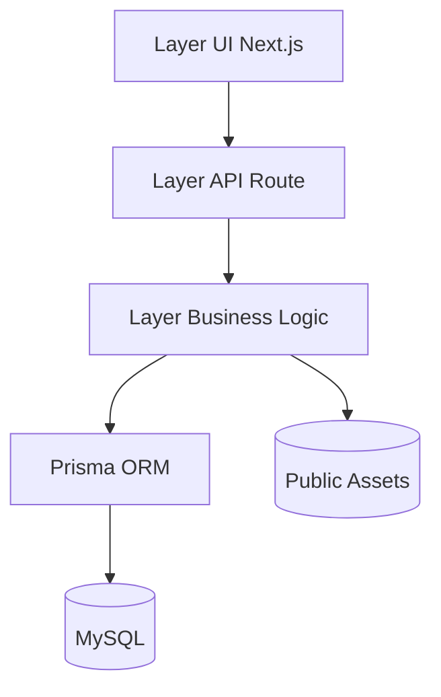
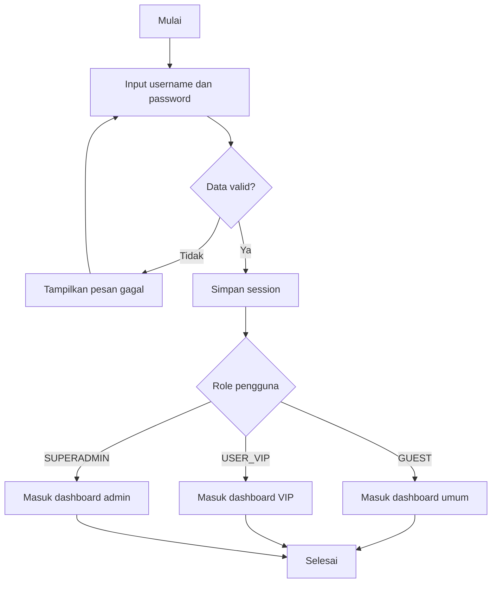
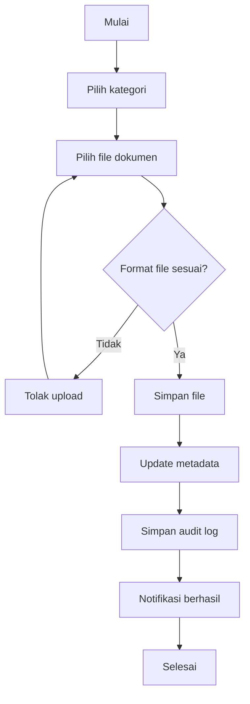

# STYLE CETAK LAPORAN

Gunakan file ini melalui mode print agar format kampus otomatis diterapkan.

<style>
@media print {
    @page {
        size: A4;
        margin: 4cm 3cm 3cm 4cm;
    }

    body {
        font-family: "Times New Roman", serif;
        font-size: 12pt;
        line-height: 1.5;
    }

    h1, h2, h3 {
        page-break-after: avoid;
    }

    .page-break {
        page-break-before: always;
        break-before: page;
    }
}
</style>

# HALAMAN JUDUL

LAPORAN PERANCANGAN SISTEM INFORMASI  
DASHBOARD GCG PT SEMEN BATURAJA

Disusun untuk memenuhi tugas mata kuliah  
Analisis dan Perancangan Sistem Informasi

Disusun oleh:  
Nama: ........................................  
NIM: .........................................  
Kelas: .......................................

Program Studi: Sistem Informasi / Teknik Informatika  
Fakultas: ....................................  
Universitas: ..................................  
Tahun: 2026

---

<div class="page-break"></div>

# LEMBAR PENGESAHAN

Judul: Perancangan Sistem Dashboard GCG PT Semen Baturaja

Laporan ini telah diperiksa dan disetujui pada:

Hari/Tanggal: ................................

Dosen Pengampu,  

Tanda tangan: .................................  
Nama Dosen: ..................................  
NIDN: .........................................

---

<div class="page-break"></div>

# KATA PENGANTAR

Puji syukur penulis panjatkan ke hadirat Tuhan Yang Maha Esa karena atas rahmat-Nya laporan ini dapat diselesaikan dengan baik. Laporan ini berjudul Perancangan Sistem Dashboard GCG PT Semen Baturaja dan disusun sebagai bagian dari pemenuhan tugas akademik.

Laporan ini membahas analisis kebutuhan sistem, spesifikasi teknis, rancangan UML, flowchart proses utama, serta rancangan antarmuka sistem. Penulis berharap dokumen ini dapat menjadi referensi pembelajaran dan pengembangan sistem informasi tata kelola perusahaan.

Penulis menyadari bahwa laporan ini masih memiliki keterbatasan. Oleh karena itu, kritik dan saran yang membangun sangat diharapkan.

Kota, April 2026  
Penulis

---

<div class="page-break"></div>

# DAFTAR ISI

1. BAB 1 PENDAHULUAN
2. BAB 2 LANDASAN TEORI DAN SPESIFIKASI TEKNIS
3. BAB 3 ANALISIS DAN PERANCANGAN UML
4. BAB 4 FLOWCHART DAN DESAIN SISTEM
5. BAB 5 PENUTUP
6. DAFTAR PUSTAKA
7. LAMPIRAN

---

<div class="page-break"></div>

# ABSTRAK

Dashboard GCG merupakan sistem informasi berbasis web yang dirancang untuk mendukung pengelolaan Good Corporate Governance secara terintegrasi. Sistem ini mengelola akses dashboard, pelaporan, regulasi, assessment, serta administrasi dokumen pada satu platform. Laporan ini disusun dalam format laporan kampus dengan pembahasan kebutuhan sistem, spesifikasi teknis, diagram UML, flowchart, serta desain antarmuka.

Kata kunci: Dashboard, GCG, UML, Flowchart, Sistem Informasi.

---

<div class="page-break"></div>

# BAB 1 PENDAHULUAN

## 1.1 Latar Belakang

Perusahaan membutuhkan sistem yang mampu menyajikan informasi tata kelola secara cepat, akurat, dan terpusat. Pengelolaan laporan dan dokumen secara manual berisiko menimbulkan keterlambatan informasi, inkonsistensi data, dan kendala dalam audit. Karena itu, Dashboard GCG dirancang sebagai solusi digital untuk mendukung monitoring serta pengambilan keputusan.

## 1.2 Rumusan Masalah

1. Bagaimana merancang sistem Dashboard GCG yang terstruktur dan mudah dipelihara?
2. Bagaimana memodelkan alur proses sistem menggunakan UML dan flowchart?
3. Bagaimana menyusun spesifikasi teknis yang dapat dijadikan acuan implementasi?

## 1.3 Tujuan

1. Menyusun rancangan sistem Dashboard GCG berbasis web.
2. Menyajikan model sistem menggunakan diagram UML.
3. Menyusun flowchart proses utama sistem.
4. Menentukan spesifikasi teknis perangkat lunak dan perangkat keras.

## 1.4 Manfaat

1. Memudahkan pengelolaan data GCG secara terintegrasi.
2. Meningkatkan transparansi dan akuntabilitas informasi.
3. Menjadi acuan pengembangan sistem pada tahap berikutnya.

## 1.5 Batasan Masalah

1. Fokus pembahasan pada modul autentikasi, dashboard, pelaporan, regulasi, assessment, dan admin.
2. Integrasi eksternal di luar sistem inti tidak dibahas mendalam.
3. Pengujian performa lanjutan tidak dibahas pada dokumen ini.

---

<div class="page-break"></div>

# BAB 2 LANDASAN TEORI DAN SPESIFIKASI TEKNIS

## 2.1 Landasan Teori

1. Sistem Informasi Dashboard: media visual untuk memantau indikator kinerja secara ringkas.
2. Good Corporate Governance: prinsip transparansi, akuntabilitas, tanggung jawab, independensi, dan kewajaran.
3. UML: bahasa pemodelan visual untuk kebutuhan, struktur, dan interaksi sistem.
4. Flowchart: pemetaan proses langkah demi langkah untuk memudahkan analisis.

## 2.2 Spesifikasi Teknis Perangkat Lunak

1. Framework: Next.js 16.1.6.
2. Library antarmuka: React 19.2.3.
3. Bahasa pemrograman utama: TypeScript.
4. ORM: Prisma 5.22.0.
5. Database: MySQL.
6. Session management: iron-session.
7. Visualisasi data: Recharts.
8. Pengolahan dokumen: xlsx, jsPDF, jsPDF-autotable.

## 2.3 Spesifikasi Teknis Perangkat Keras Minimum

1. Processor minimal 4 core.
2. RAM minimal 8 GB (disarankan 16 GB).
3. Ruang penyimpanan kosong minimal 10 GB.
4. Sistem operasi: Windows, Linux, atau macOS.

## 2.4 Kebutuhan Fungsional

1. Sistem menyediakan login berbasis akun pengguna.
2. Sistem menampilkan dashboard ringkasan GCG.
3. Sistem menyediakan akses dokumen regulasi dan assessment.
4. Sistem menyediakan fitur pelaporan berdasarkan kategori data.
5. Admin dapat mengelola dokumen, pengguna, dan pengaturan konten.
6. Sistem mencatat aktivitas penting ke audit log.

## 2.5 Kebutuhan Non-Fungsional

1. Keamanan: akses berbasis peran dan session.
2. Keandalan: konsistensi data dokumen dan pelaporan.
3. Maintainability: arsitektur modular untuk kemudahan pengembangan.
4. Usability: antarmuka responsif untuk desktop dan mobile.

## 2.6 Struktur Package Sistem

```txt
dashboard-gcg/
|-- src/
|   |-- app/                  # routing halaman dan API
|   |-- components/           # komponen antarmuka per fitur
|   `-- lib/                  # utilitas bisnis, session, prisma, dokumen
|-- prisma/                   # schema, migration, seed
|-- public/assets/            # aset dokumen dan media
|-- scripts/                  # utilitas import data
`-- docs/                     # dokumentasi proyek
```

## 2.7 Format Penulisan Laporan Kampus

1. Font: Times New Roman, ukuran 12.
2. Spasi: 1.5.
3. Margin: kiri 4 cm, atas 4 cm, kanan 3 cm, bawah 3 cm.
4. Penomoran bab: BAB 1, BAB 2, BAB 3, dan seterusnya.
5. Penomoran subbab: 1.1, 1.2, 1.3, dan seterusnya.

---

<div class="page-break"></div>

# BAB 3 ANALISIS DAN PERANCANGAN UML

## 3.1 Aktor Sistem

1. SUPERADMIN: mengelola pengguna, dokumen, dan audit log.
2. USER_VIP: mengakses dashboard, pelaporan, regulasi, dan assessment.
3. GUEST: mengakses dashboard umum dan regulasi tertentu.

## 3.2 Use Case Diagram



## 3.3 Sequence Diagram Proses Login



## 3.4 Class Diagram Data Utama



## 3.5 Component Diagram



---

<div class="page-break"></div>

# BAB 4 FLOWCHART DAN DESAIN SISTEM

## 4.1 Flowchart Proses Login



## 4.2 Flowchart Proses Upload Dokumen Admin



## 4.3 Desain Antarmuka

1. Prinsip desain: ringkas, informatif, dan fokus data utama.
2. Komponen utama: navbar, sidebar, KPI card, tabel laporan, viewer dokumen.
3. Responsivitas:
   - Desktop: sidebar tetap.
   - Tablet: sidebar collapsible.
   - Mobile: menu off-canvas dan konten vertikal.

## 4.4 Rancangan Tampilan Konseptual

```txt
+--------------------------------------------------------------+
| Navbar: Logo | Search | User Menu                           |
+---------------------------+----------------------------------+
| Sidebar                   | Konten Utama                     |
| - Dashboard               | KPI Cards                        |
| - Pelaporan               | Grafik dan tabel                 |
| - Regulasi                | Daftar dokumen                   |
| - Assessment              | Ringkasan status                 |
| - Admin                   | Aksi manajemen                   |
+---------------------------+----------------------------------+
```

---

<div class="page-break"></div>

# BAB 5 PENUTUP

## 5.1 Kesimpulan

Perancangan Dashboard GCG telah memenuhi kebutuhan dasar sistem informasi tata kelola melalui integrasi modul, pengelolaan dokumen, dan kontrol akses berbasis peran. Pemodelan UML serta flowchart membantu memperjelas proses bisnis dan arsitektur sistem.

## 5.2 Saran

1. Menambahkan pengujian otomatis untuk modul API kritikal.
2. Menyusun SOP pembaruan data berkala agar konsisten.
3. Mengembangkan monitoring performa dan notifikasi lanjutan.

---

<div class="page-break"></div>

# DAFTAR PUSTAKA

1. Pressman, R. S. Rekayasa Perangkat Lunak.
2. Sommerville, I. Software Engineering.
3. Dokumentasi resmi Next.js.
4. Dokumentasi resmi Prisma.

---

<div class="page-break"></div>

# LAMPIRAN

Lampiran A: Screenshot halaman dashboard.  
Lampiran B: Screenshot halaman admin.  
Lampiran C: Detail endpoint API utama (opsional).
